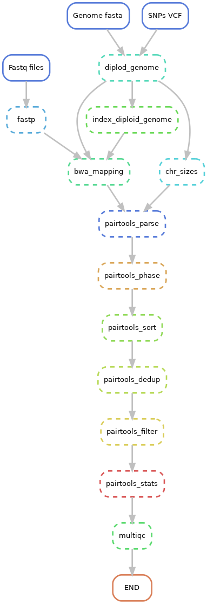

# SnakeMake-Pairtools-Phased
Workflow to run analyze Hi-C data in allelic mode

## Requirements
- Snakemake > 8.X

All tools are integrated in a conda environment defined in `env.yaml`, so run with `--use-conda` flag.

## Inputs
- Fastq paired-ends files as `_1.fastq.gz` and `_2.fastq.gz`
- Genome bgzip2 compressed Fasta with index (`samtools faidx genome.fa.gz`)
- VCF with parental SNPs with each parent as a Sample, file compressed with bgzip2 and indexed with tabix

## Outputs
- 01_preprocessing: Fastp reports and trimmed fastq
- 02_diplod_genome: Diplod genome fasta and BWA indexes
- 03_mapping: BAM files
- 04_pairing: pairtools parsing and deduplication
- 05_filter: pairtools phasing
- 06_stats: pairtools stats
- 07_multiqc: multiQC reports

## Execution
0. Clone this repository and enter it
1. Create a custom `config.yml` file from the template `config.yml.template`
2. Activate your SnakeMake environment
3. Execute the pipeline as:
`snakemake -c 10 --configfile /path/to/config.yml -d output_dir --use-conda`

The pipeline is mostly linear, but can be used with Slurm or similar with a proper `--profile`

## Workflow

(C) Juan Caballero 2024